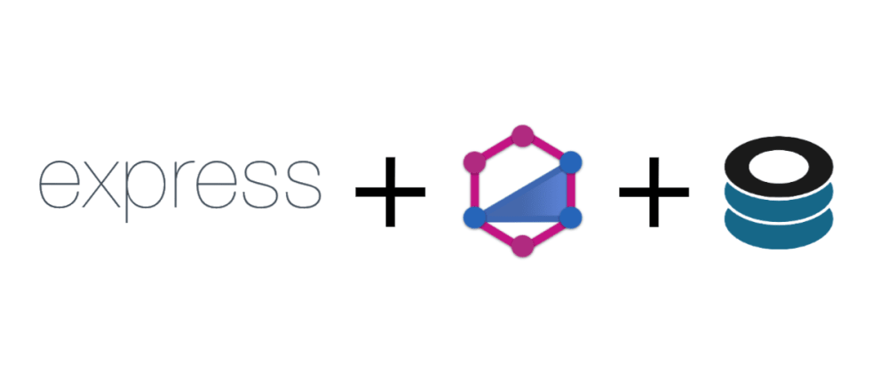

<h1 align="center">
    
    <p>GraphQL + MongoDB</p>
</h1>

<h4 align="center"> 
	API desenvolvida em GraphQL utilizando MongoDB.
</h4>

<div align="center">

[]()
[]()
[]()
[]()
[](/LICENSE)

</div>

## 📝 Conteúdo
<p align="center">
<a href="#fabricio">Sobre</a>&nbsp;&nbsp;&nbsp;|&nbsp;&nbsp;&nbsp;
<a href="#getting_started">Iniciando</a>&nbsp;&nbsp;&nbsp;|&nbsp;&nbsp;&nbsp;
<a href="#installing">Instalando</a>&nbsp;&nbsp;&nbsp;|&nbsp;&nbsp;&nbsp;
<a href="#built_using">Tecnologias Utilizadas</a>&nbsp;&nbsp;&nbsp;|&nbsp;&nbsp;&nbsp;
<a href="#authors">Autor</a>
</p>

## 🧐 Sobre <a name = "fabricio"></a>


## 🏁 Iniciando <a name = "getting_started"></a>
Instruções de como acessar as rotas e instalação.
```bash
http://localhost:3100/graphql


Make a Get Request
query{
  categories{
    name
    description
    _id
  }
}

Make a Post/Mutation Request

mutation{
  createCategory(categoryInput : {
    description: "Categoria de ação",
    name: "Ação"
  }),{
    _id
  }
}
```


### ⚒ Instalando <a name = "installing"></a>
```bash
# Clone this repository
$ git clone https://github.com/fcsouza/graphQL-api

# Go into the repository
$ cd graphQL-api/

```

## ⛏️ Tecnologias Utilizadas <a name = "built_using"></a>
- [Express](https://expressjs.com/) - Server Framework
- [NodeJs](https://nodejs.org/en/) - Server Environment
- [Apollo Server](https://nodejs.org/en/) - Apollo Server is a community-maintained open-source GraphQL server
- [Mongoose](https://nodejs.org/en/) - Mongoose provides a straight-forward, schema-based solution to model your application data. 
- [TypeGraphQL](https://nodejs.org/en/) - Modern framework for GraphQL API in Node.js

## ✍️ Autor <a name = "authors"></a>

- [@fcsouza](https://github.com/fcsouza)

## 🗒 Licença

Esse projeto está sob a licença MIT. Veja o arquivo [LICENSE](LICENSE.md) para mais detalhes.